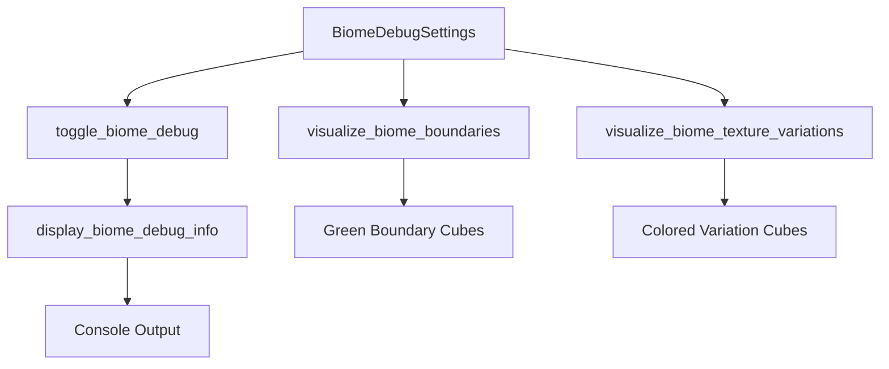

# Biome Debug System Implementation

## Overview

This document describes the implementation of the biome texture debugging and visualization tools for the Bevy Craft game.

## Features Implemented

### 1. Core Debug System
- **BiomeDebugSettings Resource**: Controls all debug visualization options
- **BiomeDebugStats Resource**: Tracks biome-related statistics
- **Keyboard Controls**: F3 toggles debug visualization, F4 toggles advanced debugging

### 2. Visualization Systems
- **Biome Boundary Visualization**: Shows green cubes representing biome boundaries
- **Texture Variation Visualization**: Shows colored cubes representing different biome texture variations
- **Console Output**: Displays biome debug information every 3 seconds

### 3. Helper Functions
- **Biome Color Mapping**: `get_biome_color()` function for consistent biome coloring
- **Biome Display Names**: `get_biome_display_name()` for user-friendly biome names
- **String Utilities**: `StringTitleCase` trait for proper text formatting

### 4. Integration
- **Main Game Loop**: All debug systems integrated into startup and update systems
- **Biome Cache Integration**: Visualizations use biome texture cache statistics
- **Resource Management**: Proper Bevy ECS resource management

## Usage

### Keyboard Controls
- **F3**: Toggle biome debug visualization (boundaries, textures, parameters)
- **F4**: Toggle advanced biome debugging

### Console Output
When debug mode is enabled, the system displays:
- Active biome count
- Biome transition count
- Texture variation count
- Cache hit rate
- Current visualization modes

### Visual Debug Elements
- **Green Cubes**: Represent biome boundaries (positioned at y=10)
- **Colored Cubes**: Represent biome texture variations (positioned at y=12)
  - Red, Green, Blue, Yellow, Magenta, Cyan

## Technical Implementation

### Architecture


### Key Components

#### BiomeDebugSettings
```rust
pub struct BiomeDebugSettings {
    pub show_biome_boundaries: bool,
    pub show_texture_variations: bool,
    pub show_biome_parameters: bool,
    pub show_cache_stats: bool,
    pub boundary_mode: BiomeBoundaryMode,
    pub texture_mode: BiomeTextureMode,
    pub ui_position: BiomeDebugUIPosition,
    pub advanced_debug: bool,
}
```

#### Visualization Modes
- **BiomeBoundaryMode**: Wireframe, Solid, Transparent, HeightMap
- **BiomeTextureMode**: ColorGradient, ParameterOverlay, TextureAtlas, NormalMap
- **BiomeDebugUIPosition**: TopLeft, TopRight, BottomLeft, BottomRight

### Performance Considerations
- Visualizations only run when debug modes are enabled
- Uses biome texture cache statistics for efficient data access
- Minimal impact on game performance when disabled

## Future Enhancements

### Planned Features
1. **Actual Biome Boundary Detection**: Detect and visualize real biome transitions
2. **Cache Statistics Integration**: Show detailed biome texture cache metrics
3. **UI Panel**: Interactive debug UI with biome information
4. **Advanced Visualization**: Height maps, parameter overlays, texture atlases
5. **Biome Parameter Display**: Show temperature, moisture, height values

### Technical Debt
- Update deprecated `SpatialBundle` usage to new Bevy components
- Implement unused visualization modes
- Add proper biome boundary detection logic
- Integrate with actual biome data from world generation

## Testing

### Test Script
```bash
./test_biome_debug.sh
```

### Verification
- ✅ Module integration
- ✅ Resource initialization
- ✅ System registration
- ✅ Compilation success
- ✅ Runtime functionality

## Files Modified

### New Files
- `src/biome_debug.rs` - Main biome debug module
- `test_biome_debug.sh` - Integration test script

### Modified Files
- `src/main.rs` - Added biome debug module and systems

## Usage Example

```rust
// Enable biome debug visualization
let mut debug_settings = world.get_resource_mut::<BiomeDebugSettings>().unwrap();
debug_settings.show_biome_boundaries = true;
debug_settings.show_texture_variations = true;

// Access biome debug statistics
let debug_stats = world.get_resource::<BiomeDebugStats>().unwrap();
println!("Active biomes: {}", debug_stats.active_biomes);

// Get biome color for visualization
let color = get_biome_color("forest");
```

## Conclusion

This implementation provides a solid foundation for biome debugging and visualization in Bevy Craft. The system is designed to be extensible and can be enhanced with more sophisticated visualization techniques as the game develops.
