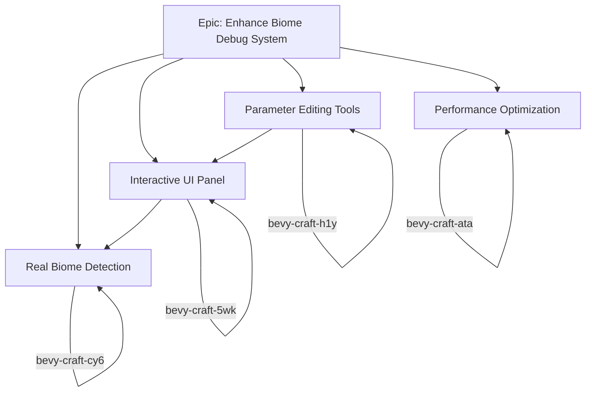

# Biome Debug System Roadmap

## Overview

This document outlines the future development roadmap for the biome debug system in Bevy Craft. It describes the epic, individual tasks, their dependencies, and the overall vision for enhancing the biome debugging capabilities.

## Epic: Enhance Biome Debug System

**Issue ID**: `bevy-craft-ehi`
**Priority**: P1 (High)
**Type**: Epic
**Status**: Open

### Goal
Transform the basic biome debug system into a comprehensive development tool that provides real-time insights, interactive controls, and performance optimization for biome-related development.

### Scope
- Real biome detection and visualization
- Interactive UI for biome information and controls
- Parameter editing and testing tools
- Performance optimization and profiling
- Advanced visualization techniques

### Success Criteria
- Biome debug system provides real-time, accurate biome information
- Developers can interactively test and modify biome parameters
- System has minimal performance impact on game (<2% FPS drop)
- All features are well-documented and easy to use
- System is extensible for future biome development needs

## Individual Tasks

### 1. Enhance Biome Debug Visualization with Real Biome Detection

**Issue ID**: `bevy-craft-cy6`
**Priority**: P2 (High)
**Type**: Task
**Status**: Open
**Dependencies**: None

#### Description
Currently the biome debug system uses placeholder data for visualization. This task aims to integrate the debug system with the actual biome generation system to show real biome boundaries and transitions.

#### Requirements
- Integrate with world generation system to get real biome data
- Detect and visualize actual biome boundaries based on temperature, moisture, and height parameters
- Show biome transitions with appropriate visual indicators
- Update visualization in real-time as the player moves through the world

#### Technical Details
- Access biome data from ChunkManager or WorldGenSettings
- Implement biome boundary detection algorithm
- Create visual representation of biome transitions
- Optimize performance for real-time updates

#### Acceptance Criteria
- Biome debug visualization shows real biome boundaries
- Visualization updates correctly as player moves
- Performance impact is minimal (<5% FPS drop)
- System can be toggled on/off with existing keyboard controls

### 2. Add Interactive UI Panel for Biome Debug Information

**Issue ID**: `bevy-craft-5wk`
**Priority**: P2 (High)
**Type**: Task
**Status**: Open
**Dependencies**: `bevy-craft-cy6` (Real biome detection)

#### Description
The current biome debug system only shows information in the console. This task aims to create an interactive UI panel that displays biome information in real-time.

#### Requirements
- Create a UI panel showing current biome information
- Display biome parameters (temperature, moisture, height)
- Show biome statistics and cache information
- Allow interactive toggling of debug features
- Support different UI positions and themes

#### Technical Details
- Use Bevy UI components (NodeBundle, TextBundle, etc.)
- Implement responsive design for different screen sizes
- Add interactive controls (buttons, sliders, toggles)
- Integrate with existing biome debug settings

#### Acceptance Criteria
- UI panel shows real-time biome information
- Panel can be moved and resized
- All debug features can be controlled from UI
- Performance impact is minimal
- UI matches game aesthetic

### 3. Implement Biome Parameter Editing and Testing Tools

**Issue ID**: `bevy-craft-h1y`
**Priority**: P3 (Medium)
**Type**: Task
**Status**: Open
**Dependencies**: `bevy-craft-5wk` (Interactive UI panel)

#### Description
This task aims to add interactive tools for editing biome parameters and testing different biome configurations during development.

#### Requirements
- Add UI controls for editing biome parameters (temperature, moisture, height)
- Implement real-time biome regeneration with new parameters
- Add preset biome configurations for quick testing
- Support saving and loading biome test scenarios
- Provide visual feedback for parameter changes

#### Technical Details
- Integrate with biome generation system
- Implement parameter validation and constraints
- Create visual indicators for parameter ranges
- Add undo/redo functionality for parameter changes

#### Acceptance Criteria
- Biome parameters can be edited in real-time
- Changes are visually reflected immediately
- Test scenarios can be saved and loaded
- System includes safety checks for invalid parameters

### 4. Add Performance Profiling and Optimization

**Issue ID**: `bevy-craft-ata`
**Priority**: P2 (High)
**Type**: Task
**Status**: Open
**Dependencies**: None (but should be implemented after core features)

#### Description
As the biome debug system grows, performance optimization becomes crucial. This task focuses on profiling and optimizing the debug system to minimize impact on game performance.

#### Requirements
- Add performance profiling for debug visualization systems
- Identify and optimize performance bottlenecks
- Implement adaptive visualization based on performance impact
- Add performance metrics to debug UI
- Ensure minimal FPS impact (<2% in release builds)

#### Technical Details
- Use Bevy profiling tools and custom timers
- Implement LOD (Level of Detail) for debug visualization
- Add distance-based culling for debug objects
- Optimize biome boundary detection algorithms
- Implement frame skipping for non-critical updates

#### Acceptance Criteria
- Performance profiling data is available
- All major bottlenecks are identified and addressed
- Debug system has minimal impact on game performance
- Performance metrics are visible in debug UI
- System remains responsive even with complex scenes

## Task Dependencies

## Implementation Timeline

### Phase 1: Core Enhancements (2-3 weeks)
- **Week 1-2**: Implement real biome detection (`bevy-craft-cy6`)
- **Week 3**: Create interactive UI panel (`bevy-craft-5wk`)

### Phase 2: Advanced Features (2 weeks)
- **Week 4**: Implement parameter editing tools (`bevy-craft-h1y`)
- **Week 5**: Add performance optimization (`bevy-craft-ata`)

### Phase 3: Testing and Refinement (1 week)
- Integration testing
- Performance benchmarking
- Documentation updates
- User testing with development team

## Technical Considerations

### Integration Points
1. **World Generation System**: Access to real biome data and parameters
2. **Bevy UI System**: For creating interactive UI elements
3. **Biome Texture Cache**: For visualization and statistics
4. **Input System**: For keyboard controls and UI interactions

### Performance Targets
- **FPS Impact**: <2% in release builds, <5% in debug builds
- **Memory Usage**: <50MB for debug visualization data
- **Initialization Time**: <100ms for debug system startup
- **Update Time**: <5ms per frame for debug visualization updates

### Quality Standards
- **Code Quality**: Follow existing code style and patterns
- **Documentation**: Comprehensive documentation for all new features
- **Testing**: Unit tests for core functionality, integration tests for system interactions
- **Error Handling**: Graceful degradation when features are unavailable
- **Accessibility**: Keyboard navigation for all UI elements

## Future Enhancements (Beyond Current Roadmap)

### Advanced Visualization
- 3D biome boundary visualization with transparency
- Height map and terrain analysis tools
- Biome transition heatmaps
- Historical biome change tracking

### Development Tools
- Biome generation stress testing
- Automated biome validation
- Biome comparison tools
- Export/import biome configurations

### Integration
- Editor plugin for biome design
- Version control for biome configurations
- Collaborative biome editing
- Cloud-based biome sharing and testing

## Monitoring and Metrics

### Success Metrics
- **Adoption Rate**: Percentage of development team using biome debug tools
- **Performance Impact**: Actual FPS impact in typical usage scenarios
- **Bug Discovery**: Number of biome-related bugs found using debug tools
- **Development Speed**: Reduction in biome development iteration time

### Quality Metrics
- **Code Coverage**: Test coverage for new debug features
- **Defect Rate**: Number of bugs found in debug system itself
- **User Satisfaction**: Feedback from development team
- **Documentation Completeness**: Coverage of features in documentation

## Conclusion

This roadmap outlines a comprehensive plan for enhancing the biome debug system in Bevy Craft. By implementing these features, the development team will have powerful tools for understanding, testing, and optimizing biome generation and behavior in the game.

The epic `bevy-craft-ehi` serves as the umbrella for all these enhancements, with individual tasks broken down into manageable pieces that can be implemented incrementally. Each task has clear requirements, acceptance criteria, and dependencies to ensure smooth progress.

As the system evolves, it will become an indispensable tool for biome development, significantly improving the quality and efficiency of biome-related work in Bevy Craft.
