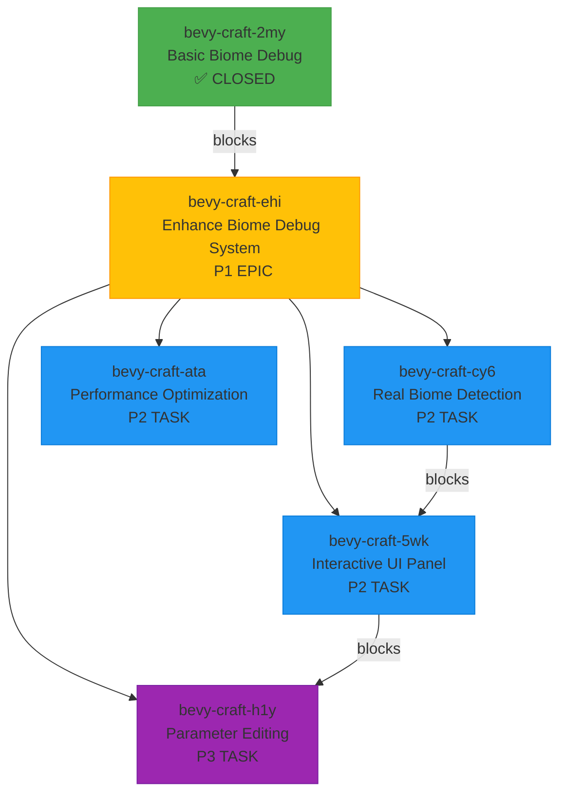

# Biome Debug System - Task Summary

## Current Status

### ✅ Completed Tasks

#### **bevy-craft-2my**: Add biome texture debugging and visualization tools
- **Status**: ✅ CLOSED
- **Priority**: P3
- **Type**: Task
- **Implementation**: Basic biome debug system with visualization and keyboard controls
- **Features Implemented**:
  - BiomeDebugSettings resource for configuration
  - BiomeDebugStats resource for tracking statistics  
  - Keyboard controls (F3, F4) for toggling debug modes
  - Console output for biome debug information
  - Basic visualization of biome boundaries and texture variations
  - Framework for future enhancements

### 🚀 Future Tasks (Roadmap)

#### **bevy-craft-ehi**: Epic: Enhance Biome Debug System
- **Status**: ○ OPEN
- **Priority**: P1 (High)
- **Type**: Epic
- **Dependencies**: bevy-craft-2my (completed)
- **Blocks**: 4 tasks
- **Goal**: Transform basic system into comprehensive development tool

#### **bevy-craft-cy6**: Enhance biome debug visualization with real biome detection
- **Status**: ○ OPEN
- **Priority**: P2 (High)
- **Type**: Task
- **Dependencies**: None
- **Blocks**: bevy-craft-5wk
- **Focus**: Integrate with real biome generation system

#### **bevy-craft-5wk**: Add interactive UI panel for biome debug information
- **Status**: ○ OPEN
- **Priority**: P2 (High)
- **Type**: Task
- **Dependencies**: bevy-craft-cy6
- **Blocks**: bevy-craft-h1y
- **Focus**: Create interactive UI for biome information

#### **bevy-craft-h1y**: Implement biome parameter editing and testing tools
- **Status**: ○ OPEN
- **Priority**: P3 (Medium)
- **Type**: Task
- **Dependencies**: bevy-craft-5wk
- **Blocks**: None
- **Focus**: Add interactive parameter editing

#### **bevy-craft-ata**: Add performance profiling and optimization
- **Status**: ○ OPEN
- **Priority**: P2 (High)
- **Type**: Task
- **Dependencies**: None
- **Blocks**: None
- **Focus**: Optimize system performance

## Task Dependency Graph



## Implementation Priority

### Phase 1: Core Enhancements (High Priority)
1. **bevy-craft-cy6**: Real biome detection (P2)
2. **bevy-craft-5wk**: Interactive UI panel (P2)

### Phase 2: Advanced Features (Medium Priority)
3. **bevy-craft-h1y**: Parameter editing tools (P3)
4. **bevy-craft-ata**: Performance optimization (P2)

### Phase 3: Refinement
- Integration testing
- Performance benchmarking
- Documentation updates
- User testing

## Current vs Future Comparison

### Current Implementation (bevy-craft-2my)
```
✅ Basic Features:
- Keyboard toggles (F3, F4)
- Console output
- Simple visualization
- Debug statistics
- Framework for extension

❌ Limitations:
- Uses placeholder data
- No real biome detection
- Console-only output
- Basic visualization
- No interactive controls
```

### Future Implementation (bevy-craft-ehi)
```
✅ Enhanced Features:
- Real biome detection
- Interactive UI panel
- Parameter editing
- Performance optimization
- Advanced visualization

✅ Additional Benefits:
- Real-time biome information
- Interactive testing
- Better usability
- Minimal performance impact
- Comprehensive toolset
```

## Task Relationships

### Dependency Chain
```
bevy-craft-2my (Basic System)
    ↓
bevy-craft-ehi (Enhancement Epic)
    ↓
bevy-craft-cy6 (Real Detection) → bevy-craft-5wk (UI Panel) → bevy-craft-h1y (Editing)
    ↓
bevy-craft-ata (Performance)
```

### Blocking Relationships
- **bevy-craft-ehi** blocks all enhancement tasks
- **bevy-craft-cy6** blocks UI development
- **bevy-craft-5wk** blocks parameter editing
- **bevy-craft-h1y** has no dependencies
- **bevy-craft-ata** can be implemented in parallel

## Resource Estimation

### Time Requirements
- **bevy-craft-cy6**: 1-2 weeks
- **bevy-craft-5wk**: 1 week
- **bevy-craft-h1y**: 1 week
- **bevy-craft-ata**: 1 week
- **Total**: 4-5 weeks

### Team Requirements
- **Primary Developer**: 1 (Rust/Bevy experience)
- **QA Tester**: 0.5 (part-time)
- **Documentation**: 0.2 (part-time)

## Quick Reference

### Issue IDs
- **Completed**: `bevy-craft-2my`
- **Epic**: `bevy-craft-ehi`
- **Real Detection**: `bevy-craft-cy6`
- **UI Panel**: `bevy-craft-5wk`
- **Parameter Editing**: `bevy-craft-h1y`
- **Performance**: `bevy-craft-ata`

### Commands
```bash
# View epic details
bd show bevy-craft-ehi

# View all biome-related tasks
bd list --title-contains "biome"

# View dependency graph
bd graph bevy-craft-ehi

# Check task status
bd status
```

## Next Steps

### Immediate Actions
1. ✅ Complete basic implementation (bevy-craft-2my) - DONE
2. ✅ Create enhancement roadmap - DONE
3. ✅ Add tasks to issue tracker - DONE
4. ✅ Document task relationships - DONE
5. ⏳ Start implementation of bevy-craft-cy6 (Real biome detection)

### Mid-term Actions
1. Implement real biome detection
2. Create interactive UI panel
3. Add parameter editing tools
4. Optimize performance

### Long-term Actions
1. Monitor system usage and gather feedback
2. Identify additional enhancement opportunities
3. Plan future iterations based on user needs
4. Maintain and update documentation

## Conclusion

The biome debug system has been successfully implemented at a basic level (bevy-craft-2my) and provides a solid foundation for development and testing. The comprehensive roadmap outlines a clear path for enhancing this system into a powerful development tool.

With the epic (bevy-craft-ehi) and individual tasks properly defined and prioritized, the development team can systematically improve the biome debug capabilities over the coming weeks. Each task has clear requirements, acceptance criteria, and dependencies to ensure smooth progress.

As these enhancements are implemented, the biome debug system will evolve from a basic visualization tool into a comprehensive development environment that significantly improves the quality and efficiency of biome-related work in Bevy Craft.
